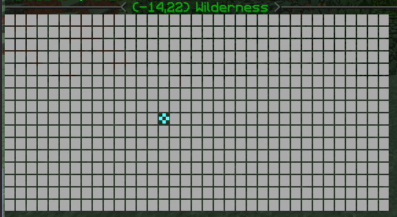
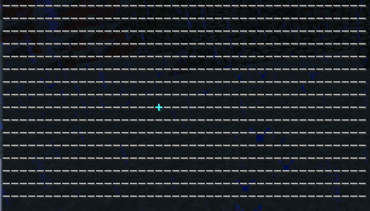

#illyriaFactions
###Configureable Map

The Factions Map was changed into a block based map system, causing some people to want to revert back.
Open "/plugins/Factions/conf.json" in your favorite text editor.

The current conf.json is on the left, and can be edited to show the map attached on the right.
Make sure to pay special attention to the mapWidth option as the characters for the maps are different widths.

    "mapWidth": 40,
    "mapYouAreHereIcon": "✜",
      "mapFlatIcon": "▉",
      "mapKeyChrs": [
        "✦",
        "✴",
        "✵",
        "❷",
        "❸",
        "❹",
        "❺",
        "❻",
        "❼",
        "❽",
        "❾",
        "❿"
        ],

___
    "mapWidth": 49,
    "mapYouAreHereIcon": "+",
      "mapFlatIcon": "-",
      "mapKeyChrs": [
        "\\",
        "/",
        "#",
        "$",
        "%",
        "=",
        "&",
        "^",
        "A",
        "B",
        "C",
        "D",
        "E",
        "F",
        "G"
        ],

